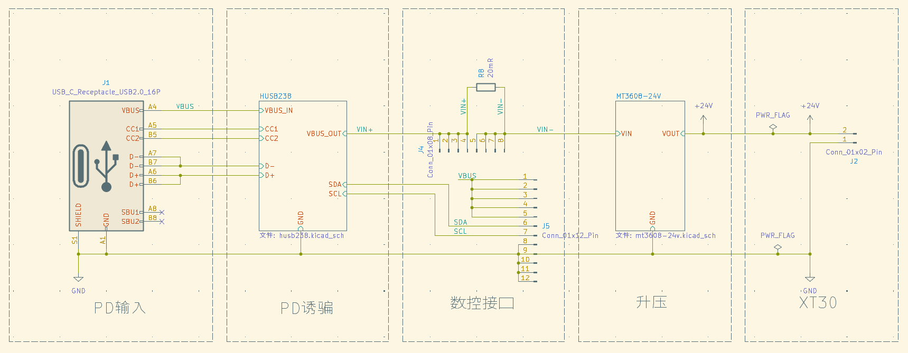
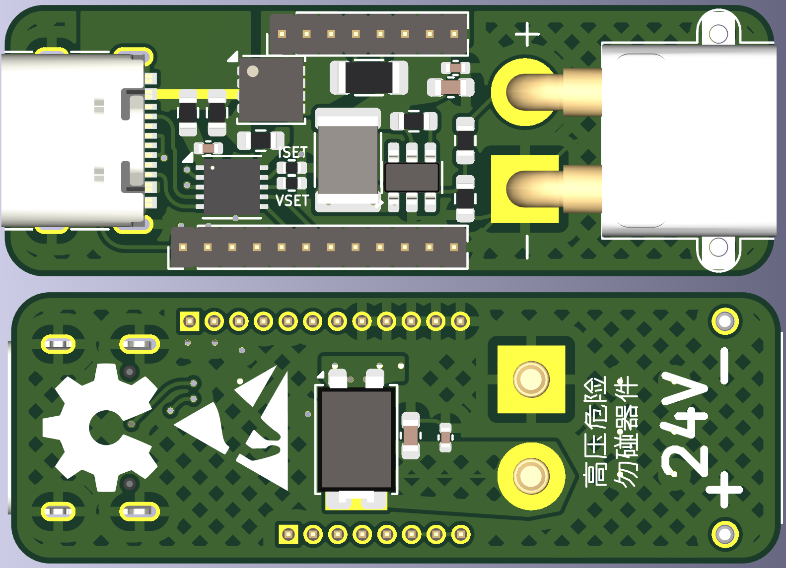
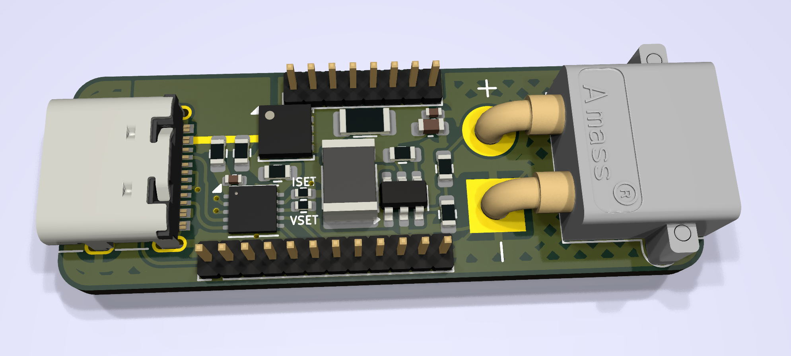
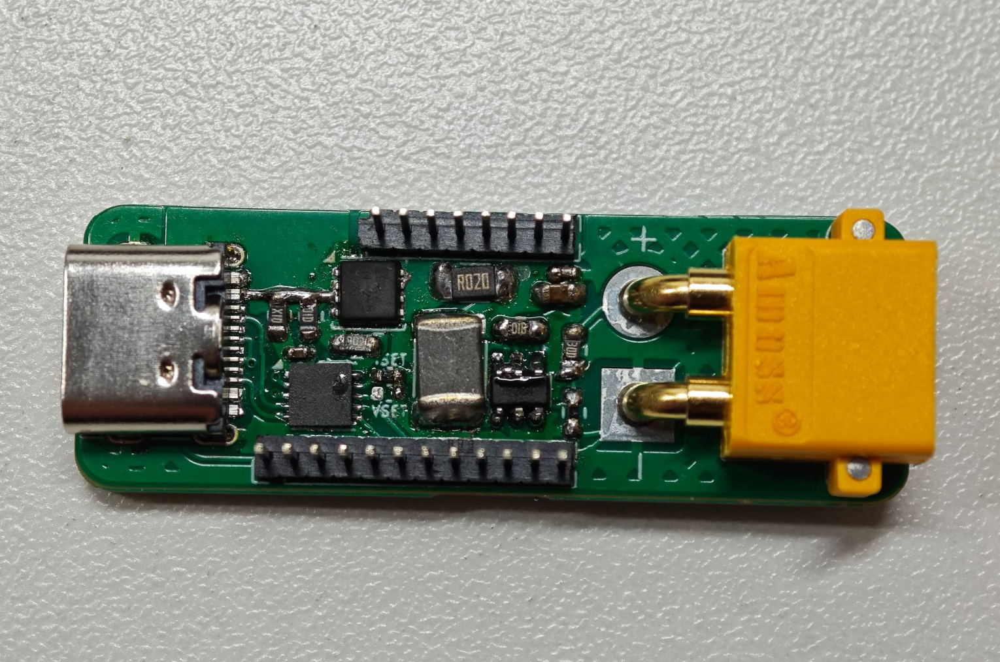

# PD24
> PD输入24V（可调输出）升压输出模块

## 原理图

简单来说就是使用`HUSB238`诱骗PD输出20V（诱骗不到20V就以此往下诱骗，最低5V）的电压，`CSD25402Q3A`过流控制，然后通过`MT3608`升压到24V输出

哪怕完全不支持PD，也可以输出24V，不过能够提供的功率就比较有限了

保留了数控接口，可以将`PD24`的输入电压和总线上的电流电压传给`PD24_ctrl`模块，计划通过INA226读取，并在OLED上显示

## 2D/3D Preview

## 实物焊接

> 因为没有开钢网，所以这些都是用烙铁上锡后用加热台焊接的，经常容易把控不住锡量，焊接比较难看，但是不影响功能

## 后话

这个模块一开始的时候因为电感没有到，所以我就直接焊上去用，结果`MT3608`和电感一下子就烧了，现在想想可能是因为没有焊接输出电容的原因，导致芯片震荡，最终烧掉